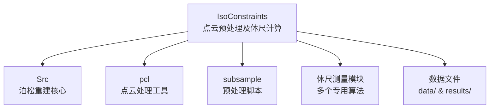

# 点云预处理及体尺计算代码项目文档 (IsoConstraints)

## 项目愿景

本项目是一个用于点云预处理和动物体尺计算的软件系统。主要基于带等值面约束的泊松方程来优化点云法向量并重建表面，特别适用于畜牧业中的动物体尺测量应用。该项目通过改进的泊松重建算法，能够处理带未定向法线的点云数据，实现法向量定向和表面重建。

## 架构总览

该项目是一个混合型项目，包含：
- **C++泊松重建核心**：实现带等值面约束的泊松重建算法
- **点云处理模块**：基于PCL的点云处理功能
- **体尺测量模块**：针对动物体尺的测量算法
- **Python预处理脚本**：点云随机采样工具

### 核心架构组件

1. **主算法模块** (`Src/PoissonRecon.cpp`)：实现IsoConstraints算法核心，包括粗点云定向、隐式场定向和泊松表面重建
2. **点云处理** (`pcl/pclknn.cpp`)：使用PCL库进行KNN搜索功能
3. **体尺计算** (多个`.cpp`文件)：实现动物体尺的各种测量（体长、肩高、胸围、腹围、髋宽高等）
4. **预处理脚本** (`subsample/random_sample.py`)：提供点云随机采样功能

## 模块结构图



## 模块索引

| 模块路径 | 主要职责 | 关键文件 |
|---------|---------|---------|
| `Src/` | 泊松重建核心算法 | `PoissonRecon.cpp`, `MultiGridOctreeData.h` |
| `pcl/` | 点云处理与KNN搜索 | `pclknn.cpp` |
| `subsample/` | 点云预处理脚本 | `random_sample.py` |
| `体尺测量/` | 各种体尺测量算法 | `Body_length_measurement.cpp`, `Withers_heigh.cpp` 等 |

## 运行与开发

### 编译环境
- Windows平台
- Visual Studio (项目文件: `PoissonRecon.sln`)
- PCL库 (版本 1.10.1)
- 需要将PCL的bin目录添加到系统环境变量

### 主程序运行
```bash
./Bin/x64/Release/PoissonRecon.exe coarse_filein fine_filein fileout use_implicit_orient is_noisy_input oriented_optimized
```

### 示例运行命令
```bash
./Bin/x64/Release/PoissonRecon.exe ./data/xyzrgb_statuette_coarse.xyz ./data/xyzrgb_statuette_fine.xyz ./results/xyzrgb_statuette.ply true false true
```

### 点云法线估计
```bash
./jet/normals_estimation.exe input_xyz output_xyz neighbour_size
```

### 点云随机采样
```bash
cd ./subsample
python random_sample.py
```

## 测试策略

项目包含多种测试示例，分布在以下文件：
- 数据文件：`./data/` 目录下的各种点云文件
- 结果文件：`./results/` 目录下包含重建后的结果

## 编码规范

- C++代码遵循标准C++规范
- 使用OpenMP进行并行计算
- 点云数据格式为`.xyz`（包含位置和法线信息）或`.ply`格式
- 体尺测量代码使用PCL库进行点云处理

## AI 使用指引

这个项目非常适合用于以下AI应用：

1. **动物体尺测量**：通过点云数据计算动物的身体尺寸
2. **点云法向量定向**：处理未定向的点云法线
3. **表面重建**：从点云数据生成网格模型
4. **畜牧业应用**：自动化动物体型评估

项目中的体尺测量算法包括：
- 体长测量 (`Body_length_measurement.cpp`)
- 肩高测量 (`Withers_heigh.cpp`)
- 胸深测量 (`Chest_depth.cpp`)
- 胸宽测量 (`Chest_width.cpp`)
- 髋高测量 (`Hip_height.cpp`)
- 髋宽测量 (`Hip_width.cpp`)
- 腹围测量 (`abdominal_grith.cpp`)
- 腹宽测量 (`abdominal_width.cpp`)
- 腹高测量 (`abdominal_height.cpp`)

## 变更记录 (Changelog)

- **2025-12-15**: 项目架构分析完成，创建文档
  - 识别了核心泊松重建算法模块
  - 识别了点云处理和体尺测量模块
  - 记录了项目编译和运行方法